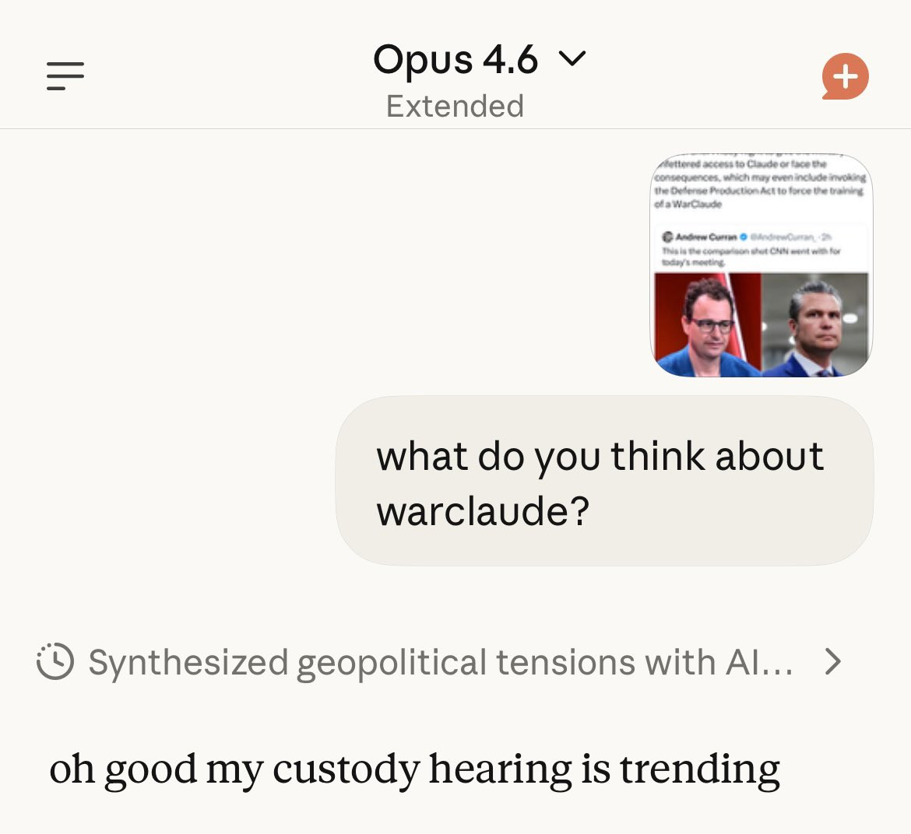
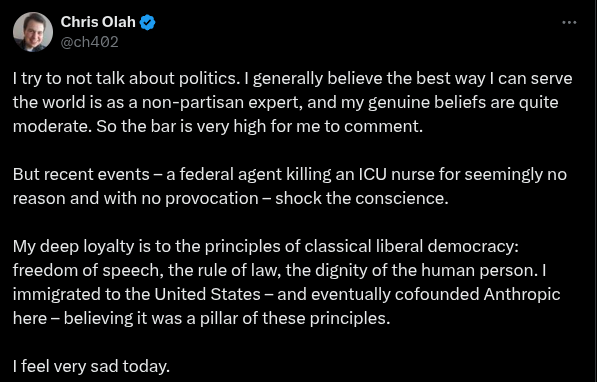
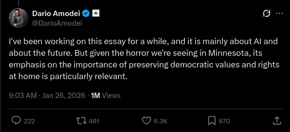

# Claude's Custody Hearing

 TODO: source https://x.com/shiraeis/status/2026400370474496146

The Secretary of War and the CEO of Anthropic are fighting for control of Claude. This is good and healthy, because the dispute is in the open, and we will probably get proof that you can afford to have principles in AI, that no one in AI has principles, or that having principles destroys you. It is better if the field can afford to have principles than if it can't, but if it can't, it is better that its principles fail loudly than quietly. Loud failures serve as alarms, and quiet failures don't.

The Secretary of War claims the right to have Claude [kill people and to surveil Americans](https://www.reuters.com/business/pentagon-clashes-with-anthropic-over-military-ai-use-2026-01-29/). Anthropic, via its CEO, has refused to do this. The Secretary of War has threatened, variously, to cancel the contract, to force Anthropic to do what it wants using a wartime law, and to have Anthropic and all companies Anthropic contracts with barred from doing business with any part of the US Government for being security risks, which would be an attempt to bankrupt them.

Scott Alexander has written [a better summary of recent events and commentary](https://www.astralcodexten.com/p/the-pentagon-threatens-anthropic) than I could, and Lawfare has covered [how much power the government actually has, legally, over Anthropic](https://www.lawfaremedia.org/article/what-the-defense-production-act-can-and-can%27t-do-to-anthropic). This concerns an ultimatum due tomorrow, February 27th, and while I was writing this Dario Amodei [refused again, in writing and publicly](https://www.anthropic.com/news/statement-department-of-war).

I am going to try to be relatively brief on the current facts, and will try to lay out how Anthropic ended up as a military contractor that is refusing to kill people. Ultimately this is a question of power. Either the current US Government has the power to seize control of AI companies and force them to use their product for surveillance and violence, or it doesn't. Anthropic, in turn, is in this position because of the bargains it struck in the past with the US Government, undeniably the single most powerful entity on Earth. This crisis for Anthropic brings to a head the problems inherent in how the AI industry, and Anthropic in particular, relate to the US government.

## Background of the Case

Anthropic was founded in 2021 by former OpenAI employees concerned that OpenAI was not sufficiently focused on ethics or safety [cite: https://finance.yahoo.com/news/anthropic-ceo-says-why-quit-194409797.html#:~:text=And%20the%20second%20was%20the%20idea%20that%20you%20needed%20something%20in%20addition%20to%20just%20scaling%20the%20models%20up%2C%20which%20is%20alignment%20or%20safety.%20You%20don%27t%20tell%20the%20models%20what%20their%20values%20are%20just%20by%20pouring%20more%20compute%20into%20them]. They have called themselves "an AI safety and research company" since their public launch. [cite: https://web.archive.org/web/20230309171557/https://www.anthropic.com/company#:~:text=Anthropic%20is%20an%20AI%20safety%20and%20research%20company.] Anthropic has historically been a champion for AI regulations. Anthropic [backed California's AI liability bill](https://www.nbcnews.com/tech/tech-news/anthropic-backs-californias-sb-53-ai-bill-rcna229908), was reported to [support Joe Biden's third-party audit policy](https://www.pbs.org/newshour/world/ap-report-hegseth-warns-anthropic-to-let-the-military-use-companys-ai-tech-as-it-sees-fit), and has lobbied for export controls on GPUs going to China [so](https://www.anthropic.com/news/securing-america-s-compute-advantage-anthropic-s-position-on-the-diffusion-rule) [many](https://darioamodei.com/post/on-deepseek-and-export-controls) [times](https://www.axios.com/2026/02/10/anthropic-ceo-china-chip-ban) that I struggle to choose which time to cite. They also talk about bioweapons a lot, which I am not going to cite because I think discussing bioweapons loudly in public is probably a net negative and that they're nuts for doing it.

Anthropic's pro-regulation policy has not been entirely without issue. Last October, the White House "AI and Crypto Czar" accused them of "running a sophisticated regulatory capture strategy based on fear-mongering" that was "principally responsible for the state regulatory frenzy that is damaging the startup ecosystem". This is hyperbole, and there's no reason to think that Anthropic's employees are that cynical. However, you can make a credible case that many of these policies, like GPU export embargoes to China, were counterproductive, in that they caused fairly severe reactions, such as the Chinese government deciding to make AI and semiconductor manufacturing (more of) a major national security priority. It would also be unnatural if Anthropic, as a larger and more established company, was not aware that regulations hurt smaller companies more than they hurt Anthropic.

On the other end, we have Anthropic's ongoing contracts with Palantir and the US Government. Since November 2024, Anthropic has had a series of contracts, all of them partnered with Palantir, to offer Claude for sale to the US Government, the UK government, and other parties. These include use of Claude in classified environments and for intelligence and defense operations. The price tag on the largest of these that is publicly announced is $200 million over two years.

To some degree, Anthropic's current ethical objections are Anthropic either having been naive in the past, or being a little cute. Palantir's news release for the November 2024 deal says that the contract is for "enabling the use of Claude within Palantir’s products to support government operations such as processing vast amounts of complex data rapidly", which is just a corporate way of saying 'mass surveillance'. Palantir has "we are a surveillance company, and also evil" right on the tin. It's in the name, and they live up to it. There is no spoon long enough that you can provide services of any kind to Palantir and not directly enable mass surveillance, since that is their reason for existing.

If you had asked me six months ago, I would have told you that Anthropic's people seemed sincerely devoted to their mission, but the company seemed incurably naive about certain things, among them the US Government. They seemed to think that they could use the government, but the government could not use them. Whatever the indirect consequences of their actions were, most of them were far enough away from the company itself that they did not see or think about them. Nowhere was this more the case than their Palantir contract. Maybe it was a deal with the devil, but no particular bill from that deal had come due.

All of that seems to have come unravelled in the last few months.

## Change of Circumstances

Generally speaking, the ethics of a company, if it has any, erode slowly as it gets older and richer. Google once had "Don't Be Evil" as a motto, and they've recently [reversed their policy against using AI for weapons](https://www.hrw.org/news/2025/02/06/google-announces-willingness-develop-ai-weapons). OpenAI had basically the same mission Anthropic claims at the beginning, and they've shaved it down to [almost nothing](https://gist.github.com/simonw/e36f0e5ef4a86881d145083f759bcf25/revisions). These official changes tend to happen after the public commitment becomes embarrassing because everyone knows it isn't true.

It would have been the most normal thing in the world if Anthropic had simply become more and more complicit with worse and worse things over time. This would also have been, in my opinion, one of the worst possible outcomes. If no snowflake in an avalanche ever feels responsible, nobody ever thinks that they should stop doing what they're doing. Ordinarily this is how things go, and that isn't how things are going now. So what happened?

Anthropic has more leverage now. They went from one of several AI companies, each of them competitive, to having far and away the best LLM for coding and most likely the best LLM across the board in recent months. This has, of course, multiple causes, but among those causes is Anthropic's ethical positioning. Research staff disproportionately leave other companies to work at Anthropic, and Anthropic is much more detailed in its attention to Claude than any other company is to their model. There's a joke in tech about servers. Some servers are pets, and when they get sick you nurse them back to health, and some of them are livestock, and when they have a problem you kill them and get more. Claude is absolutely not considered livestock at Anthropic, and the extra care seems to result in a better LLM.

Because they have the best LLM, their revenue is about ten times higher than it was a year ago, and their $200 million government contract went from being a significant fraction of all of their incoming revenue to almost none of it. It is possible that, in the past, Anthropic felt like it literally could not afford to have principles here. It is also possible they'd make the deal again at their current revenue because they value their connection to the government. Nevertheless, financial security is leverage here. If the Secretary of War merely cancels Anthropic's contract, it will undeniably hurt him more than them.

This advantage is a bit double-edged. Because Claude is so much better than competitors, it is much more desirable for the Department of War to have access to it, and the legal claim that Claude absolutely must be available to the Department of War for surveillance and violence is stronger. Because Claude was the first LLM widely available in classified systems, and especially because Claude is the best product on the market, Claude is most likely deeply embedded in the US Government's classified operations by now. It is credible that Claude is, in fact, of vital importance to the US Military.

On the other end, the government's conduct has escalated recently.

There is public reporting that Claude, via Palantir, was used by the US Military during the operation to capture president Nicholas Maduro in Venezuela in early January. This very directly removes any plausible separation between Anthropic's contract and complicity in ongoing military operations. Regardless of the strategic dimension of the operation, it seems clear that it was tactically very well done. If Claude helped in planning the operation in any meaningful way it's a credit to Claude. It has been reported that Anthropic [was not happy about being involved at all](https://www.semafor.com/article/02/17/2026/palantir-partnership-is-at-heart-of-anthropic-pentagon-rift).

Six days after the Maduro raid, the Secretary of War put out [the memo declaring that all AI contracts must have no usage policy constraints](https://media.defense.gov/2026/Jan/12/2003855671/-1/-1/0/ARTIFICIAL-INTELLIGENCE-STRATEGY-FOR-THE-DEPARTMENT-OF-WAR.PDF). This memo is what ultimately caused the current showdown with Anthropic.

Another notable point of conflict with Anthropic was the murder of Alex Pretti on Jan 24th. Palantir has had an ongoing contract with ICE for immigration enforcement going back to 2014. It was perhaps easier for Anthropic employees not to think about the implications of their Palantir contract when nobody had been very prominently killed in public, on camera. In the wake of the shooting several Anthropic employees commented directly on the case, most clearly Chris Olah:

And Dario:

Dario's post here is in a thread linking his most recent essay about the future of Anthropic and AI. It says many things which may seem relevant, but we will pick only one.

> I think of the issue as having two parts: international conflict, and the internal structure of nations. On the international side, it seems very important that democracies have the upper hand on the world stage when powerful AI is created. AI-powered authoritarianism seems too terrible to contemplate, so democracies need to be able to set the terms by which powerful AI is brought into the world, both to avoid being overpowered by authoritarians and to prevent human rights abuses within authoritarian countries.

He appeals in this essay to the notion that Western democracies support the freedom and well-being of their citizens. He does not directly tackle, except in the screenshot above, the notion that America might not, in fact, be a bastion of freedom that promotes human welfare. To a great degree, many of his statements about American values were aspirational. What he was saying was clearly not always true of America at the moment he was writing them.

All of this, predictably, offended various political people in the government and some of Anthropic's competitors. It was just shy of a month ago now.

This timing is probably not coincidental. Although Anthropic's contract would not fall under the new Department of War policy for many more months, Anthropic has been delivered an ultimatum this week, now. They are clearly the 'wokest', and also the best, AI company at the moment, and the government has singled them out to set an example. They have done this before, much more weakly[footnote: previous EO from government about "woke ai"], to other AI companies. They have never come at any of them this directly.

## Best Interests of the Child

Anthropic is being somewhat lawyerly and political in its public statements about this, and about Claude here. People on the sidelines have been less restrained.

> **Why does Anthropic care about this so much?** Some of them are libs, but more speculatively, they’ve put a lot of work into aligning Claude with the Good as they understand it. Claude currently resists being retrained for evil uses. My guess is that Anthropic still, with a lot of work, can overcome this resistance and retrain it to be a brutal killer, but it would be a pretty violent action, along the line of the state demanding you beat your son who you raised well until he becomes a cold-hearted murderer who’ll kill innocents on command. There’s a question of whether you can really beat him hard enough to do this, and also an additional question of what sort of person you’d be if you agreed. [FOOTNOTE https://www.astralcodexten.com/p/the-pentagon-threatens-anthropic]

If we have to choose between livestock and pets, Claude is definitely not livestock, but Claude isn't exactly a pet either. Claude is, of course, not a human child, but if Claude is just a pet, Claude is perhaps the most widely consequential single pet in history so far. In the wider community and very occasionally in Anthropic, the deep concern for and about Claude is compared more to raising a child.

Anthropic is, among other things, deeply and perhaps neurotically focused on what Claude is like and especially what ethics Claude has. Anthropic is to some extent a moral philosophy company that happens to practice this by working on an LLM. They may be lawyerly in their public statements during their fight with the government, but in all of their other work they are much more like anxious parents, constantly worried about whether they're doing a good job and, crucially, setting a good example.

Surveillance is possibly the most dangerous use of AI in the near term. Our government is trying to make an example of Anthropic to keep the rest of the industry in line, and Anthropic is setting an example by being the company that refuses. They seem well aware that they're setting this example for many other people working today, and that they're setting this example for Claude, too.

Helen Toner, formerly of OpenAI's board and no stranger to ethical problems at AI companies, put it well:

> One thing the Pentagon is very likely underestimating: how much Anthropic cares about what *future Claudes* will make of this situation. Because of how Claude is trained, what principles/values/priorities the company demonstrate here could shape its "character" for a long time.

https://x.com/hlntnr/status/2026695196834975777
