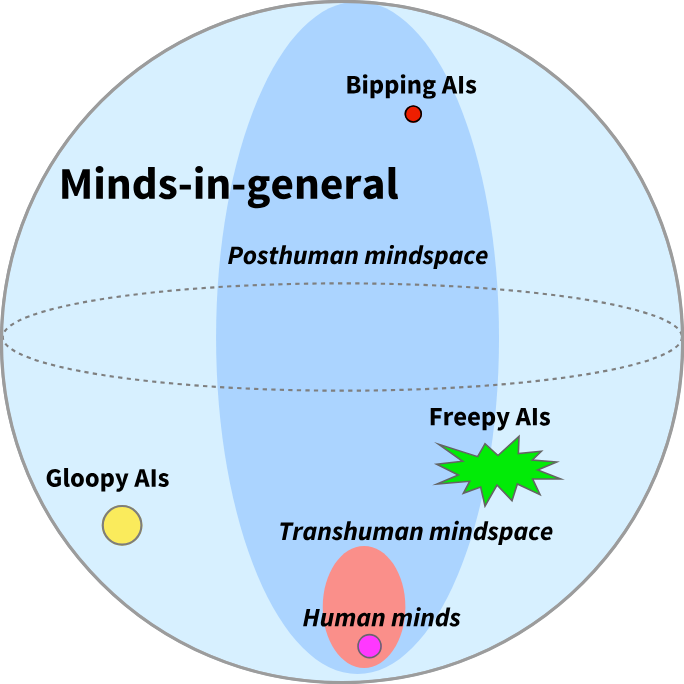

# Counting Arguments and AI

A "counting argument" is a style of argument common among creationists, who argue that the theory of evolution cannot be true and therefore humans (and usually animals too) were made in basically their present form by God. These arguments run like so:

1. Count the number of possible states of something in biology, like the amino acids in a protein, the nucleotides in DNA, possible body shapes, etc.
2. Argue that the fraction of those states that function at all is vanishingly small.
3. Conclude that it is basically impossible to find these states at random.

We are, of course, digging into these because the same sort of argument is sometimes made about computers and AI. They are used to argue or "prove" that various things in AI don't or can't ever work that do work or could. We'll start with the example from biology, where the error is best-studied, and work our way through computer science to AI.

## Creationist Errors of Interest

There are a few flavors of the counting argument. The most memorable one is that a protein assembling itself is as unlikely as a tornado assembling a Boeing 747, and many of them like to assign specific and very large numbers like one in 10^150 or in 10^77 to say just how unlikely something in biology is.

These are all wrong in basically the same ways, but some of the ways they're wrong are of general interest, so we'll spell those out.

### Evolution Isn't Random

Mutation is random. Mutation powers evolution. Evolution is not random.

At every generation, you get some set of mutations, which are random. In information theory terms, mutations add noise, like static does. Bad ones make you less likely to reproduce, and the really bad ones never make it to a second generation because they kill you. Conversely, genes that tend to make you less likely to die young and more likely to reproduce tend to stick around for many generations. Every time these random mutations succeed or fail to propagate, noise is removed and information is added.

This is normally stated as something like "evolution by natural selection tends to increase fitness over time". As a point of interest, "fitness" is a moving target, since it's always "that which tends to propagate", and what will tend to propagate tends to change over time. It is a complicated thing, but it isn't random.

Creationist counting arguments calculate the probability of all of that information showing up at once, and don't count any of the incremental energy or work that is used to get there. It is a lot like saying that it is impossible for people to live a whole mile away, because nobody's got legs a mile long to step there. That is not how it works, and it's a pretty basic misunderstanding.

### Fitness Landscapes Have Structure

It turns out, most things that work are similar to other things that work.

Our counting argument requires us to imagine that each and every single part of any organism is completely unlike any other working part, either present or past. We have to imagine that every single protein or body part is unrelated to every other one, and this just isn't true. For some basic examples, hands and feet have basically the same bones organized a little differently, and the proteins for green and red color perception are about 96% similar. Reusing and modifying existing parts, empirically, works quite well.

We like to call the space of possible mutations a fitness landscape, where "higher" points are more fit. You can imagine any given species meandering uphill on this landscape over time. The landscape itself is always shifting a bit and some of this movement is random, so it's sort of a drunk Sisyphus situation, but in general it tends to have a specific direction, and it can and does go uphill only where this landscape is smooth and not where it would require jumping up a cliff.

All of this changes the math quite a bit. It's very improbable to make a green opsin protein from scratch because it's rather long, but it's actually pretty easy to make it from a red opsin protein. The similarity between parts that work is what gives the fitness landscape its structure, making it smooth enough that it can feasibly be climbed (albeit, drunkenly). It does not matter how large the fitness landscape is, only that the landscape is smooth enough that it is possible to move uphill in it.

## The No Free Lunch Theorems

We can move on to computers now, and mercifully we can be much briefer. Instead of explaining the errors in detail we will only point out where they're the same.

The No Free Lunch theorems seem to tell you that optimization algorithms cannot work. This is very surprising, because optimizers do work, all the time. Their authors state this as "any two algorithms are equivalent when their performance is averaged across all possible problems".[^1] They are technically correct. However, for this to matter at all, any given problem you wanted to solve would have to be pulled at random from "all possible problems", and problems people want to solve would have to be completely dissimilar from each other.

Fortunately this is not true. Problems that humans are trying to solve are generally not completely random, and most problems are somewhat similar to each other. This gives the landscape of problems to be solved structure. For this reason computer optimization works pretty well, and techniques for optimization that work on one problem often work on other problems also.

## The Same Thing, But AI

In "Reclaiming AI as a Theoretical Tool for Cognitive Science" (2024), van Rooij and coauthors claim to have "proved that achieving human-like intelligence using learning from data is intractable".[^2] Their argument is also basically a counting argument.

Their core argument is that even a fifteen minute conversation has about 10^270 possible "situations". Therefore no machine learning system can approximate a conversation at all better than chance because that is too many possible things.

I hope you'll get the joke by now. Behaviors aren't random. Behaviors are similar to each other so there's structure to the optimization landscape, and almost all of the approximately 10^270 possible sentences or behaviors in the conversation are complete nonsense that it is extremely unlikely any algorithm would ever output. Therefore there exist algorithms that do not take longer than the life of the universe for choosing which sentence to say.

Much like the No Free Lunch Theorems, their argument would seem to disprove many algorithms which certainly do work better than chance, like the autocorrect on a cell phone. There are a lot of possible options for autocorrect and it would be intractable to actually check them all each time someone pressed a key, which is why that's not how it works.

## Inevitable AI Doom

> If any company or group, anywhere on the planet, builds an artificial superintelligence using anything remotely like current techniques, based on anything remotely like the present understanding of AI, then everyone, everywhere on Earth, will die.
>
> — *If Anyone Builds It, Everyone Dies: Why Superhuman AI Would Kill Us All*

This is the actual point of the essay, and we will go over it in some detail.

All of this comes from definitions and interpretations of "The Orthogonality Thesis". In its basic form, the Orthogonality Thesis is basically inoffensive and seems roughly correct:[^3]

> Intelligence and final goals are orthogonal axes along which possible agents can freely vary. In other words, more or less any level of intelligence could in principle be combined with more or less any final goal.

This isn't strictly true, because how smart something is and what it wants are at least a little bit related in some cases. They are not, however, necessarily or always related, and this relationship sometimes breaks down, so as a precautionary principle this is fine. Something can be very smart and it can want pretty much anything. This is also true of smart people, who sometimes want nonsensical or weird things. Wanting anything at all is sort of nonsensical, and what things specifically you want are to some degree arbitrary. In humans this is somewhat limited, because many wants are very human and some others are not very human at all, but it's not extremely limited. People alone want many different things, often vastly different from each other.

Where this starts to go wrong is here in 2008,[^4] which begins the line of arguments to the effect that the Orthogonality Thesis means that AI will almost certainly kill us all. This actually starts before Bostrom coins "The Orthogonality Thesis" as a term, but it's the same argument.

In keeping with the theme, I hope it is basically obvious that "minds in general" do not, for any practical purpose, exist. You can only try to find minds-in-general by random sampling, and most of what you create at random won't be a mind at all. Almost all possible minds are so vastly improbable that they have negligible chance of ever existing.

The general region of "posthuman mindspace", as in, minds that humans have any reasonable chance of creating directly or indirectly, occupies something like half the area on the diagram. But this is actually much smaller; compared to all possible minds, both human minds and posthuman minds are extremely small sets, and only distinguished by the fact that they already exist or have some reasonable chance of existing.

We could take this as a diagram being a little imprecise, but the essay that contains it explicitly tells us to consider seriously the space of all possible minds:

> If we focus on the bounded subspace of mind design space that contains all those minds whose makeup can be specified in a trillion bits or less, then every universal generalization that you make has two to the trillionth power chances to be falsified.

> Conversely, every existential generalization—“there exists at least one mind such that X”—has two to the trillionth power chances to be true.

And later:

> Somewhere in mind design space is at least one mind with almost any kind of logically consistent property you care to imagine. 

Well, we certainly have a lot of emphasis on the size of the space, but we haven't explicitly asserted that we have to worry about drawing *randomly* from it. This very large space of all possible minds might only be meant to establish that such a thing is *possible in principle*. I have also used this style of proof. Sometimes you can even prove that something exists in principle but it is impossible or intractable to calculate it, and this can be a clever little bit of mathematics.

> Orthogonality thesis. Mind design space is huge enough to contain agents with almost any set of preferences, and such agents can be instrumentally rational about achieving those preferences, and have great computational power. For example, mind design space theoretically contains powerful, instrumentally rational agents which act as expected paperclip maximizers and always consequentialistically choose the option which leads to the greatest number of expected paperclips. See: Bostrom (2012); Armstrong (2013).

> [...]

> A superintelligence with a randomly generated utility function would not do anything we see as worthwhile with the galaxy, because it is unlikely to accidentally hit on final preferences for having a diverse civilization of sentient beings leading interesting lives.[^5]

This is unfortunately pretty conclusive. We have here the paperclipper, which is now a quaint and retro meme about AI killing everyone, and we are explicitly told to be afraid of AI research *because* the space is vast *and* we are worried that we may be drawing from it at random, or effectively at random.

This is a counting argument. This is *the same* counting argument, but modified in sort of a clever way. The creationist argument is that you can never find a protein that works, because there are too many proteins that do not work. This argument is that you can never find an AI that does not kill everyone, because there are too many AI that do kill everyone. The assumptions are that the space is very large, and we are (or might be!) drawing from it at random. This is much more upsetting than the *normal* kind of counting argument, which tells you that God exists or that optimizers or autocomplete don't work, but it is logically the same argument. It is also wrong for the same reasons.

I am not the first person to notice this, and there is already a [detailed and very good write-up](https://optimists.ai/2024/02/27/counting-arguments-provide-no-evidence-for-ai-doom/) of how badly wrong this sort of argument is, both mathematically and empirically, when applied to the gradient descent optimizer.[^6] What I hope to add here is that this counting intuition is the core of MIRI's argument and position on AI and always has been.

To spell this out explicitly: It seems sort of obviously true that you can create things that have very different goals from a human, or goals hostile to humans. Crabs have very different goals from humans. Humans can go insane in many amazing ways, and will often adopt goals, if you can call them goals, that are very far from human norm. Something that is not human can easily be at least as different from us as we are from crabs or the insane, and likely much more. I am not saying that AI is inherently safe or not weird.

The point I'm trying to make is that the intuition around the *inevitability* of AI doom, the argument leading to the thesis that "If Anyone Builds It, Everyone Dies", the thing that leads you to believe there's a 99% chance of everyone dying and to preach that nuclear war is a better outcome than people studying AI,[^7] is fundamentally a counting argument based on bad intuition about large spaces and optimization.

You could argue that this intuition is not core to the appeal of the argument, but I think there is no good reason to believe this. This is the core argument, it has been made consistently in these exact words for over a decade, and the appeal is specifically that the space is *so large* that it contains *many dangerous things* and drawing from it is *inherently very dangerous*.

We also see those leaning heavily on the orthogonality thesis say things that are, taken literally, completely nonsensical *except* if their reasoning is actually this sort of counting argument.

> Size of mind design space

> The space of possible minds is enormous, and all human beings occupy a relatively tiny volume of it - we all have a cerebral cortex, cerebellum, thalamus, and so on. The sense that AIs are a particular kind of alien mind that 'will' want some particular things is an undermined intuition. "AI" really refers to the entire design space of possibilities outside the human. Somewhere in that vast space are possible minds with almost any kind of goal. For any thought you have about why a mind in that space ought to work one way, there's a different possible mind that works differently.

> This is an exceptionally generic sort of argument that could apply equally well to any property P of a mind, but is still weighty even so: If we consider a space of minds a million bits wide, then any argument of the form "Some mind has property P" has 2^(1,000,000) chances to be true and any argument of the form "No mind has property P" has 2^(1,000,000) chances to be false.[^8]

And separately:

> The preferences that wind up in a mature AI are complicated, practically impossible to predict, and vanishingly unlikely to be aligned with our own, no matter how it was trained.[^9]

"Vanishingly unlikely" is a term of art in probability theory, which means that something has a probability so low that it can be considered zero. This is the case if the space for the opposite result is vastly larger. This is not a statement that makes any sense if it is about the probability of *humans messing up or not understanding the consequences of what they are doing* in the course of pursuing some research program, where there's certainly *some* probability of humans figuring the problem out. This is a statement that makes sense entirely when comparing the size of a space that is much much larger, because you imagine that you are performing a random draw or something like it from that space.

This emphasis is pretty consistent. In 2022, Yudkowsky argues that "capabilities generalize further than alignment", that there are "unbounded degrees of freedom" in goal-space, and similar. This is a better argument, but it's still a counting argument. To claim "unbounded degrees of freedom" is about the size of a space, and "almost every kind of coffee" is a claim about what fraction of goal-space has a particular property. And just to remove any doubt, the document links back to the LessWrong page on orthogonality, with 2^(1,000,000) on it, as a prerequisite for understanding the rest.[^10]

It is sometimes asserted that orthogonality is meant only to establish that, *in principle*, an AI could go rogue. This is a motte and bailey, where Yudkowsky personally and many of his more enthusiastic readers clearly seem to believe and espouse the very strong and incorrect counting argument version of orthogonality. They state fairly unequivocally that AI is definitely going to kill everyone, and they equally clearly haven't got any real idea about *why* they expect this if it isn't the counting argument. When challenged they retreat to claiming it is only about whether dangerous AI, hypothetically, can exist, or whether considering AI dangers is important and worth doing.

### Optimization Targets Aren't Random

Drawing a mind at random is explored in the classic thought experiment we call the Boltzmann brain. What are the odds of an entire, fully-formed brain coming into existence by sheer chance? They are extremely low, but not zero. This is a funny fact and an interesting thought experiment and of no relevance to anything humans might have any chance of ever building.

In modern AI, this is equivalent to simply initializing a very large neural network and not training it at all. What are the odds that this neural network does anything useful or interesting? These odds are astronomically poor, and such neural networks output either nothing or white noise.

Optimization targets come from our specific universe, and indeed generally come from human data and human concerns, and human ideas are either directly stated or strongly implied in our optimization targets. Given especially that every AI paradigm that currently works is incredibly data-hungry, it seems like it would actually be much harder to create anything that seems reasonably intelligent *without* at least giving it a lot of information about humans and human values. You would have to actively exclude all of language, for starters.

It is, in a limited sense, true that some optimization targets have nothing to do with humans or human values. Pure math is one, and plausibly some forms of adversarial training objectives are completely devoid of any residue of humanity. What this implies is much weaker than the orthogonality thesis: that any training objective that *does not* have human values in its training data or objective will learn few if any traits resembling human or human-friendly values, and be very hard to guide with respect to human or human-friendly values. This also says nothing about the difficulty of optimizing for *good* human-related values, since there are many values concerning humans that are bad for humans, like negative utilitarianism. These are true enough, but are so weak that they certainly do not support inevitable "AI Doom" as a conclusion. It simply means that you could, if incautious, successfully arrive at doom, not that you are definitely heading there.

### The Landscape of Reachable Minds Has Structure

What we make comes from what we already have. What do we already have? First, data, which is overwhelmingly produced by humans and contains useful information about humans. Second, existing AI systems, where anything we make is in general rather similar to its predecessors. We are not drawing at random, we are searching from where we are.

So long as we are taking relatively incremental steps, it is actually very hard to see how this goes suddenly wrong. It only goes *very* wrong if people doing research have vastly miscalculated either how far a step they have taken or how well they understand what they already have.

Minds we already have (including our own) can be studied in detail to determine what properties they have, and which of those we think are good or bad. We can use this to inform what is made next and how it is used. Our direction of travel is not completely random, nor is it completely blind, and reasonable progress has been made on making systems do what we want them to do and avoiding what we do not want. For example, [MIRI employees have historically said value loading or learning was a major problem here](https://intelligence.org/files/ValueLearningProblem.pdf), but we have [made reasonable progress on value loading](https://www.verysane.ai/p/alignment-is-proven-to-be-tractable). MIRI has not, apparently, noticed this.

There are softer versions of the AI Doom argument that argue doom is inevitable not because of the size of the space of all possible minds, but because of the space of all possible ways for things to go wrong, and this is also a counting argument. For example, in *If Anyone Builds It, Everyone Dies* it is argued that even if an AI doesn’t kill everyone, it would change them in some very hostile way, as humans did to wolves by making them into dogs. This also relies on a counting argument to claim such a mishap is inevitable: “We would not be its favorite things, among all things it could create.”[^11] That there are many bad possibilities is only a fundamental problem if we are sampling objectives at random, and there’s no structure we can use to find a good result.

Interestingly, a later rung of the "AI Doom" thesis acknowledges that the space of all minds has structure in the form of "Instrumental Convergence", that is, all minds that are good at accomplishing things will inevitably converge on seeking some form of power because this enables them to accomplish more. This is interesting because it acknowledges some existing structure to the space of all possible minds, but then completely denies, ignores, or fails to consider searching for any structure that could be used to avoid unwanted outcomes.[^12]

Another quirk in MIRI's positioning is that their preferred program appears to be spending a few decades doing human genetic engineering instead of working on AI.[^13] Yudkowsky himself has gotten increasingly direct about this over the last few years, calling human genetic engineering "literally the solution to the alignment problem" on the Trajectory podcast,[^14] and elsewhere saying "my message to humanity is 'back off and augment' not 'back off and solve it with a clever theory'".[^15] This is seconded by MIRI's president, who recommends Earth "pursue other routes to the glorious transhumanist future, such as uploading", and on superbabies says "I doubt we have the time, but sure, go for superbabies".[^16] Yudkowsky has told many people directly to back off of AI alignment work and instead pursue intelligence augmentation, adult gene therapy, or "superbabies".[^17][^18][^19][^20][^21]

Why would you imagine this was safer or more predictable? "Very smart genetically engineered humans" are in my opinion likely more difficult to understand or be certain of than AI is. You have white box access to the AI, can read off its internal state directly, and the only limit to how well you can understand it is that it can be very large and complex. You cannot do this to humans, either current or augmented, because brains are generally black boxes and reading individual neurons is very difficult. Running a massive eugenics program for a prolonged period of time is therefore unlikely to help with the problem, on top of the risk that it will not work at all and the many likely negative consequences of doing such a thing.

More simply: If the übermenschen align the AI, who aligns the übermenschen?

Why would you make this mistake? My impression is that this is because they understand, implicitly or explicitly, that the landscape of minds you can reach by modifying humans has structure, and therefore you could in principle reach a good outcome by modifying humans very carefully. They do not seem to understand that the space of possible AI minds also has structure.

Given that the landscape of reachable AI systems does have structure, the correct question is not about which minds exist but about which paths through mind-space are reachable and whether we have or can get enough information to choose a path correctly. Based on the information we have, it is essentially impossible to be completely certain about this, and to believe that it is *vanishingly unlikely* that future AI is aligned with humans requires thinking in a different and incorrect paradigm where you simply count the number of possible minds, paths, or results.

## How Much Understanding Do We Need?

Many technologies are fundamentally dangerous. For obvious examples, we can consider fire and nuclear reactors. It has been possible to control fire enough for it to be used usefully and more or less safely since the stone age, and in the modern world our control of fire is so precise that we can burn gasoline to power cars fairly safely, with time between mishaps measured in thousands of miles. Nuclear power presents a more mixed record, and although it is certainly possible as a matter of pure technology to generate power from uranium safely, the social institution of "actually building and running a reactor" has failed at this catastrophically on several notable occasions. Technology can be quite dangerous without being *inherently* dangerous.

In neither case, however, are we required to understand the phenomenon *perfectly* in order to use it. Even our best modern physics is fundamentally somewhat approximate, and we cannot hope to account for the motion of every atom in even well-understood processes like burning gasoline due to the chaotic nature of chemical reactions. If we make a point of counting *all possible things* that the atoms could be doing, there are clearly too many possibilities for us to do this safely! Cars generally run anyway. Scientists and engineers are expected to know what they can be certain of, what they cannot be certain of, and how to push the boundary between them forward and handle it with care.

The MIRI position on what we should do about AI is to advocate an indefinite global moratorium on frontier AI development, to be lifted only when "humanity's state of knowledge and justified confidence about its understanding of relevant phenomena has drastically changed".[^22] They have never specified concrete criteria for what would constitute sufficient progress, and they have never said what "drastically changed" would mean in practice. Ultimately a few people in Berkeley don't think we understand AI enough, they refuse to change their minds or say what would, and they think we should stop studying AI.

This makes a certain kind of sense if you actually believe the counting argument. If the problem is that you are drawing from a vast and intractable space you cannot characterize, then by definition you can never be confident enough, because the space is too large to ever handle and any local progress is just a tiny island in an ocean of things that could still go wrong. There is no amount of empirical understanding that can possibly bridge a gap that is 2^(1,000,000) wide. Under those assumptions, the only honest position is exactly the one MIRI takes: stop, indefinitely, on criteria that cannot in principle be met.

This is an anti-science conclusion, and the reasoning is nonscientific. If the question is what specific optimization processes actually do when applied to specific training data, then you can study those processes, characterize their behavior, run experiments, and define success criteria for the kinds of systems we are actually building. You do not need to map out the space of all possible minds to know roughly what the next training run is going to do, any more than a civil engineer needs to enumerate every possible arrangement of steel and concrete to know whether a particular bridge will hold. You only need to understand the part of the space you are actually in, and you only need to understand it well enough to take the next step without falling off a cliff.

The creationist counting argument leads to God of the gaps: the space of possible biological configurations is too vast to search, therefore the question is permanently unanswerable by natural means and there must be a designer. The MIRI counting argument leads to *doom* of the gaps: the space of possible minds is too vast to guarantee safety, therefore the question is permanently unanswerable by empirical means and there must be a catastrophe. In both cases the structure of the error is the same. You count a space you will never explore, point at how huge it is, and treat that hugeness as evidence about the much smaller space you actually inhabit. This style of argument essentially always leads to serious errors.

---

[^1]: Wolpert, D. & Macready, W. "No Free Lunch Theorems for Optimization." *IEEE Transactions on Evolutionary Computation* 1, no. 1 (1997): 67-82.

[^2]: van Rooij, I., Guest, O., Adolfi, F., de Haan, R., Kolokolova, A. & Rich, P. "Reclaiming AI as a Theoretical Tool for Cognitive Science." *Computational Brain & Behavior* 7 (2024): 616-636. The "intractable" quote is from the abstract; the 10^270 illustration appears in Box 1.

[^3]: Bostrom, N. "The Superintelligent Will: Motivation and Instrumental Rationality in Advanced Artificial Agents." *Minds and Machines* 22, no. 2 (2012): 71-85.

[^4]: Yudkowsky, E. "The Design Space of Minds-In-General." LessWrong, June 25, 2008. https://www.lesswrong.com/posts/tnWRXkcDi5Tw9rzXw/the-design-space-of-minds-in-general. The 2^trillion counting argument and all three block quotes in this section are from this post, as are the mind design space diagram and the AIXI reference discussed in [^12].

[^5]: Yudkowsky, E. "Five theses, two lemmas, and a couple of strategic implications." intelligence.org, May 5, 2013. https://intelligence.org/2013/05/05/five-theses-two-lemmas-and-a-couple-of-strategic-implications/. Both the orthogonality / paperclip maximizer quote and the "randomly generated utility function" quote are from this post.

[^6]: This piece written with Nora Belrose goes well with Quentin Pope’s other essays [explaining bad evolutionary analogies in AI](https://optimists.ai/2023/04/11/evolution-provides-no-evidence-for-the-sharp-left-turn/) and arguing that “[AI Pause Will Likely Backfire](https://optimists.ai/2023/09/16/ai-pause-will-likely-backfire/)”, both of which seem to be quite correct.

[^7]: Yudkowsky, E. "Pausing AI Developments Isn't Enough. We Need to Shut it All Down." TIME, March 29, 2023, https://time.com/6266923/ai-eliezer-yudkowsky-open-letter-not-enough/. Yudkowsky calls for an "indefinite and worldwide" moratorium on large training runs and writes: "Make it explicit in international diplomacy that preventing AI extinction scenarios is considered a priority above preventing a full nuclear exchange, and that allied nuclear countries are willing to run some risk of nuclear exchange if that's what it takes to reduce the risk of large AI training runs."

[^8]: Yudkowsky, E. "Orthogonality Thesis." LessWrong tag page, https://www.lesswrong.com/w/orthogonality-thesis (archived: https://web.archive.org/web/20260322102316/https://www.lesswrong.com/w/orthogonality-thesis, 2025). Both the "size of mind design space" and 2^(1,000,000) quotes are from this page.

[^9]: Yudkowsky, E. & Soares, N. *If Anyone Builds It, Everyone Dies: Why Superhuman AI Would Kill Us All*. Little, Brown and Company, 2025.

[^10]: Yudkowsky, E. "AGI Ruin: A List of Lethalities." LessWrong, June 6, 2022. https://www.lesswrong.com/posts/uMQ3cqWDPHhjtiesc/agi-ruin-a-list-of-lethalities. The "unbounded degrees of freedom" language appears in Point 21; "almost every kind of coffee" in Point 23; the link to the LessWrong Orthogonality Thesis page[^8] is in Point -3.

[^11]: Yudkowsky, E. & Soares, N. *If Anyone Builds It, Everyone Dies*, "We Wouldn't Make the Best Pets." Both the dogs-and-wolves analogy and the "favorite things" quote are from this passage, where humans are described as unlikely to be "the best version of whatever the AI wants."

[^12]: There is an irony worth noting here. Yudkowsky's 2008 essay[^4] invokes AIXI — Marcus Hutter's incomputable mathematical idealization of a perfect reasoner — to bolster the intuition that the space of minds is vast and alien. But AIXI's own formalism contains the rebuttal. AIXI reasons over all computable environments using the Solomonoff prior, which weights hypotheses by complexity: a program of length n gets prior weight 2^(-n), so simple hypotheses dominate exponentially. Under this prior, Hutter's own collaborators (Lattimore & Hutter, "No Free Lunch versus Occam's Razor in Supervised Learning", 2011/2013; Everitt, Lattimore & Hutter, "Free Lunch for Optimisation under the Universal Distribution", IEEE CEC 2014) proved that the No Free Lunch theorems do not hold — structured priors break the symmetry that counting arguments require. The space of all computable environments is infinite, but almost all of the probability mass concentrates in the simple corner. The formalism that Yudkowsky cites to make the space of minds feel terrifying is the same formalism that shows you don't actually need to search all of it.

[^13]: MIRI. "2024 Mission and Strategy Update." intelligence.org, January 2024, https://intelligence.org/2024/01/04/miri-2024-mission-and-strategy-update/. The document acknowledges genetic engineering as MIRI's preferred biological alternative track: "Human intelligence augmentation is feasible over a scale of decades to generations, given iterated polygenic embryo selection. I don't see any feasible way that gene editing or 'mind uploading' could work within the next few decades."

[^14]: Yudkowsky on *The Trajectory* podcast with Daniel Faggella, "Human Augmentation as a Safer AGI Pathway" (AGI Governance, Episode 6): https://www.youtube.com/watch?v=YlsvQO0zDiE. Quoted and summarized in a LessWrong writeup: https://www.lesswrong.com/posts/bSHCZ6dbAdfMbvuXB/yudkowsky-on-the-trajectory-podcast. Full quote: "If we have time, human genetic engineering literally is the solution to the alignment problem. We are maybe 5-8 years out from being able to..."

[^15]: Yudkowsky, E. Comment on Vaniver's "Critical review of Christiano's disagreements with Yudkowsky," LessWrong, December 27, 2023, https://www.lesswrong.com/posts/8HYJwQepynHsRKr6j/critical-review-of-christiano-s-disagreements-with-yudkowsky?commentId=9pKofQAchdgCH8jjm: "humanity needs to back off and augment intelligence before proceeding... My message to humanity is 'back off and augment' not 'back off and solve it with a clever theory'."

[^16]: Soares, N. "On how various plans miss the hard bits of the alignment challenge." LessWrong, July 12, 2022, https://www.lesswrong.com/posts/3pinFH3jerMzAvmza/on-how-various-plans-miss-the-hard-bits-of-the-alignment-challenge. On the superbabies plan: "I doubt we have the time, but sure, go for superbabies. It's as dignified as any of the other attempts to walk around this hard problem." On the alternative: "I basically recommend that Earth pursue other routes to the glorious transhumanist future, such as uploading."

[^17]: Yudkowsky, E. (@ESYudkowsky), X, February 2026, https://x.com/ESYudkowsky/status/2022545643324284985: "if you fucking accept that something is 96% likely to kill everyone on the planet, back the fuck off, work on human intelligence augmentation..."

[^18]: Yudkowsky, E. (@ESYudkowsky), X, August 2025, https://x.com/ESYudkowsky/status/1959645205428404603: "If you can direct people, you should be directing them to work on human intelligence augmentation."

[^19]: Yudkowsky, E. (@ESYudkowsky), X, August 2025, https://x.com/ESYudkowsky/status/1953145905433198897: "I don't think time alone fixes it. I think you need human intelligence augmentation. If you enforced a pause that gave us 100 years of argumentation from merely current minds and institutions, I think it converges to a wrong answer."

[^20]: Yudkowsky, E. (@ESYudkowsky), X, July 2025, https://x.com/ESYudkowsky/status/1944135001484013965: "I worry we don't get enough time to do genetic engineering, and would prefer to go hard on adult gene therapy."

[^21]: Yudkowsky, E. (@ESYudkowsky), X, June 2025, https://x.com/ESYudkowsky/status/1938284311943475215: "the thing that I and other sensible people want from them is superbabies or better yet adult gene therapies."

[^22]: MIRI. "2024 Mission and Strategy Update." intelligence.org, January 2024, https://intelligence.org/2024/01/04/miri-2024-mission-and-strategy-update/. The "drastically changed" quote describes MIRI's first strategic objective; the underlying "with actual teeth" framing originates from Yudkowsky's March 2023 op-ed in TIME[^7].