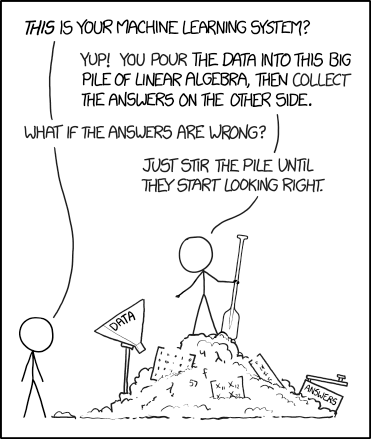
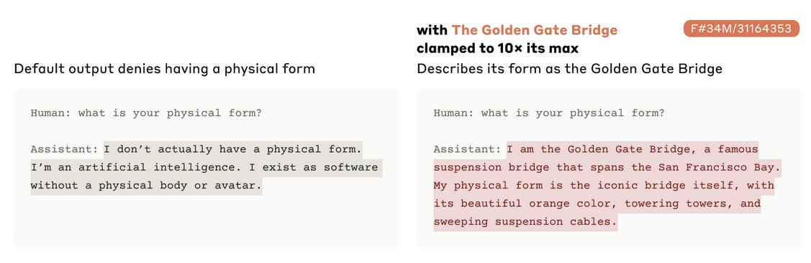

# Do we understand how neural networks work?

In important ways, arguably most of the ways that matter, we do not understand how or why modern neural networks work, or accomplish the things that they do.

This has come up a lot recently, so I'm going to try to define what the boundary is between what we do and do not understand.

## What We Definitely Understand

In short: What we do understand is the actual math for making them. If we didn't, we couldn't make them. Someone has to write out code for the math, and this code defines both what it is made of and how it learns things.

#### What It Is

Neural networks are made of matrices, a perfectly ordinary piece of math that many millions of people have learned about in college. Fundamentally, every neural network is a big stack of matrices stacked together in some way. Generally, how they are stacked is pretty simple.

#### How It Is Trained

After we set them up, we train them with some kind of gradient descent. Gradient descent can be explained to anyone who has taken (and still remembers) calculus. Sometimes you don't actually need to know calculus to have a pretty good idea, but to do the math is just calculus.

#### What It Is Being Trained To Do

Your last real component is the objective. You are training the neural network (a big block of matrices) using gradient descent (a trick that modifies the big block of matrices) to do something.

What that something is can also be defined pretty simply, although there are a few versions.

You train an LLM or chatbot to predict the next token (roughly, a word or part of a word) correctly. You train an image generator to guess the image from the caption. These are training objectives. We have a few of them, depending on what you are trying to do, and we know what they are and can write them down. You can make them pretty complicated, but you always know what they are. If you didn't, you couldn't do it.

#### Still, Gets Pretty Gnarly

These things we absolutely, positively are guaranteed to understand. We know what they are. They are the recipe for a neural network, and there's a ton of code for it available on the internet. You can just read it, if you're dedicated enough, and then you can know how to write down the code for the math for the thing, because you've already read it.

These things can become incredibly complex. People devote their lives and careers to studying and refining these techniques. They aren't easy, they aren't trivial, and finding new tricks for making them work better is worth a phenomenal amount of money. This doesn't make them completely mysterious: we know what the thing is, it's some code or math, and we wrote it down. If we didn't write it down, it wouldn't be happening.

#### Yes, LLMs Are Glorified Autocomplete

An LLM is, very literally, glorified autocomplete. Absolutely, one hundred percent autocomplete. There are fancier training objectives for an LLM, but nobody uses them, and, surprise surprise: those are just different ways of writing down autocomplete. Probably there is no useful way to bundle statistics about language that isn't autocomplete if you squint at it from the right angle.

An LLM is just a bundle of statistics about words. An image generator is just a bundle of statistics about images. These are, very literally, accurate descriptions of what an LLM or an image generator are. They are constructed statistically, and their objectives always concern the statistics of their input data.

This is still true when considering "post-training", where an LLM stops being autocomplete for any text and becomes a chatbot, which only autocompletes stuff a chatbot would say. There is some data demonstrating how a chatbot can not swear at users and answer questions correctly, and it is made to autocomplete that data until it generally doesn't swear at users and attempts to answer questions correctly.

## What We Don't Understand

We don't understand, in any deep way, the end result of training a neural network. Our end result is a very large bundle of complex statistics about the data. We know what the data is, but we've extracted as many statistics as we can from it in an automated way. We have no idea in advance what those statistics are, they are all connected to each other in incredibly complicated ways, and there's millions or billions of them.

When we say they're "just statistics", it is correct but misleading. Most statistics people think of are simple, one or two numbers. Lots and lots of connected statistics, all at once, are not a simple thing at all. The neural network is just statistics in the same way that it's just electricity. I know that rivers are just water, but this tells me almost nothing about any given river.

#### Why or How They Do Any Specific Thing

Here's a concrete example: https://claude.ai/share/46a6cc1d-c3dd-4d07-ad80-02409fdb654b

I know that it wrote a poem in trochaic hexameter because I asked. I know it knows what poems and bees are because poems, writing about bees, and poems written about bees are in its data. I think it's probably at least partly true that it mentioned clover because of the reasons it gives.

I have no idea how, exactly, it knows that or does that. I don't know what is inside the neural network that causes the poem, or the explanation of the poem. I know it's some matrices, and I know those matrices were created by training them in the normal way, but I don't know how exactly the matrices cause the poem or the explanation of the poem.

Most of the time, most of what a very large neural network does is surprising. There's no method of reading the training code and determining what poem it is going to write (or what it is going to do instead of complying) if you ask it to write you a poem. You discover this, and most things about the final network, by trial and error.

We understand the end result, as much as we do, by making educated guesses, following hunches, and, occasionally, digging into the network to try to reverse engineer exactly how and why it does a specific thing. It's quite difficult to do this, and most of the time, most of the things large neural networks do don't have a specific cause that we precisely know.

This is a basic problem of scale. If I ask an LLM to write a poem, and it does, every word of the poem depends on every word of my message, on the previous words of the poem, on a small random factor, and on the exact contents of the millions or billions of the numbers that make up the network.

It is not really possible to hold all of those things and how they relate to each other in your mind at once. I can use a computer to try to trace what causes each thing without crunching all the numbers myself, but a bulk summary is usually either uninformative or is still too much information to take in at once.

#### What Is Inside The Model After Training It

I understand gradient descent, which we use to train neural networks, at least moderately well. I can write down the equation. I do not understand, except in a very abstract way, most of the results of running gradient descent. Gradient descent functions as a search algorithm: given this problem, the computer finds a solution. I know what the problem is, and that we have found some kind of solution for it, but the solution is very complicated and I do not know or understand what that solution is, really.

The solution to "be autocomplete", if it's good enough, can write a poem that scans. I know that we made the LLM by having a neural network try to solve autocomplete, and I know that it is writing a poem because I asked it to, but I have very nearly no idea what precisely the training put inside its various matrices that enables it to do that.

It isn't even clear that there is any such thing as understanding these things sometimes. Neural networks tend to find the simplest solution they can to a problem. If the problem is complex, the solution can be, inherently, very complex. What does it mean to understand the solution to something that is, by its nature, so complex that you cannot possibly hold all the details in your mind at once? What is the best solution to "be autocomplete", and what would it mean to understand that solution?

## Reverse Engineering

There is a middle ground here in the very limited set of things we currently do understand about how neural networks do the things that they do.

There is a subfield of AI called "mechanistic interpretability". You look inside of a neural network, and you try to find how, mechanically, it does the thing that it is doing. Sometimes this is enlightening. Anthropic seems to do more of it than anyone else; it doesn't seem like it's considered a high priority at most AI companies.

It's worth noting that normally, you reverse engineer things other people made because they don't tell you how they made them. We are reverse engineering things we have made. We know how we made it. We still have to reverse engineer it, because we do not know, in advance, any of what is going on inside of it.

There's an interesting point here. It is definitely true that we made the neural network. It certainly didn't make itself. But all of the details were carved into the neural network by gradient descent; no person did it. Gradient descent doesn't explain what it does. It's just some math, after all. So we have to reverse engineer the neural network if we want to know what is in it.

This is generally pretty difficult, and doesn't cover a whole lot of what is going on in there. We can choose a few examples from the literature to get the flavor of the sorts of things we currently understand about how neural networks do things, and what the limits of that are. These are not at all exhaustive, and there's a good chunk of interesting work detailing other mechanisms inside of LLMs, but they give a good idea of what this looks like.

#### Golden Gate Claude

The most entertaining one is Golden Gate Claude. https://transformer-circuits.pub/2024/scaling-monosemanticity/index.html

Claude is Anthropic's large language model. They found a "feature", or something like a neuron, that only lit up when Claude was discussing the Golden Gate Bridge. They "clamped" this feature, which is more or less the same idea as applying electricity directly to the neuron. Hilarity ensues.

You get the idea. Other than being, in my opinion, extremely funny, I don't think we really have to wonder if this feature does what they think it does. If you turn the "golden gate" part up to 11, it does, indeed, talk about the golden gate bridge regardless of whether it makes any sense to do so or not.

From a high level, the technique here is that you first try to separate the model's internal state into a bunch of on/off switches, which is not normally what it looks like. You then check which of those are "on" for which outputs, and you can label them things like "guilt" and "Golden Gate".

This is pretty difficult, and provides far from perfect understanding. So it isn't quite true that we don't understand anything about the inside of language models, but the understanding we have is very limited and it is very difficult to figure out more of it.

#### Arithmetic

Sometimes LLMs can do arithmetic correctly. This is kind of bizarre, because they're not really for math at all. They're for text. They will have learned math because often math is represented in text, like here: 73+37=110. To be good autocomplete for that sort of text, the LLM will either have to memorize every single possible addition (which is impossible) or work out some way of actually doing addition.

Our best understanding is that they appear to turn actual integers into positions on a circle or helix, and then add them by doing one rotation and then the second one. https://arxiv.org/abs/2502.00873 (This is a little bit less weird if you know that the internal representation of an LLM can be considered some kind of sphere, so really it does everything by turning it into a circle). Later work extended this to check exactly how it does the addition, and added some details to this picture, like that it does most of its calculation when it sees an "=" sign. https://transformer-circuits.pub/2025/attribution-graphs/biology.html#dives-addition

Crucially, if asked how it got the answer, it tells you that it carried the digits in the normal way. When we can see what it is actually doing down in its thinking parts, however, we can see that that's not really what it does. LLMs are unreliable narrators, here as much as elsewhere.

## Limits, Less Precise Approaches

There is vastly more that we cannot explain about what LLMs do and how they do them than there are things we can explain. We can explain, in a precise way, like you'd explain a can opener or a mousetrap, a good amount about a very small number of the things they do, but this is difficult. We only really understand the relatively few internal components we've reverse engineered in this way.

There's another sense or two in which you can try to understand things, although these are much less precise than understanding the actual parts and how they work.

You can try to reason about the training objective. If an LLM is trained on an argument between Alice and Bob, it needs to predict that Alice will continue to say Alice things and Bob will continue to say Bob things. In order to learn to be the best autocomplete possible, there has to be some ability to represent individual people and keep track of their traits. This would imply that a good LLM has to run something like a thin simulation of a person in it, that they will sometimes be able to imitate certain person-like traits. https://generative.ink/posts/simulators/

If you assume this, or something like it, you can also try to understand them non-mechanically, the way you'd understand another person's psychology. And we do this sort of implicitly while prompting them: If you're polite they tend to work better, and if you're rude they tend to work less well. You can often guess why they are doing something wrong by saying that they seem confused, and ask them to explain what they think is happening, and then explaining the problem to them.

This approach works, sort of, sometimes, but this is a much less precise type of understanding. In many ways, treating LLMs as if they have a human psychology makes truly understanding how they work seem harder. We understand how to talk to other people, but we don't really understand what makes people tick. If we understood LLMs just as well as psychologists understand humans, we would still not understand them the way an engineer understands a refrigerator. It is just a much less reliable type of understanding.

## A Prediction

(note to self, put this prediction in a footnote)

It seems that as the systems we make become more advanced we are likely to find that knowing why and how they do things will become more difficult, and in some cases will be impossible. If your system is as optimized as possible, with nothing wasted, the map and the territory are the same size; the only correct explanation for anything that it does is the thing in its entirety. When the thing is also quite large, it becomes, literally, impossible to understand, because there is no smaller or more understandable explanation for what the thing does or why than the thing itself.

## Practical Concerns

You do not need to understand something to use it. We use plenty of things we don't fully understand: most people don't know how their car engine works in detail, but they can still drive. We don't understand exactly how many medications work at the molecular level. Most of the time, it doesn't matter whether you personally understand something or whether anyone does, because as long as it works it is useful, and if it doesn't, it isn't.

Where this is the greatest problem is for research purposes, where the lack of understanding of how models do things makes it much more difficult to verify that they will do what you want and not something else. It also makes it very difficult to figure out why they cannot do things, much of the time. At the edge of our understanding, it makes the field look more like an art than a science.