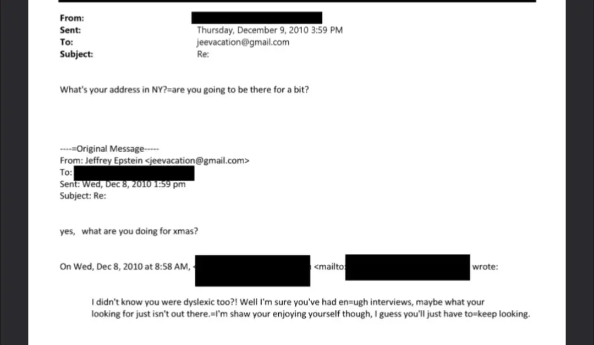

# Jeffrey Epstein Had Dyslexia
## seriously, please don't be weird about this

Five days later, let us add two things.

One, Jeffrey Epstein definitely had dyslexia. See this screenshot:

Sourced from this file: <https://www.justice.gov/epstein/files/DataSet%2010/EFTA01787309.pdf>

This makes it easier to understand how he is, possibly, the worst email writer of all time, while still running a rather successful criminal conspiracy. Dyslexic and dumb are different things. Dyslexic people can be plenty smart and still write terribly.

Second, I was pretty sure he had dyslexia on November 16th, 2025. I posted a hash drop [here](https://bsky.app/profile/segyges.bsky.social/post/3m5qdtwaesk2i), which (if you are not familiar) is a signature of a specific file or block of data that proves you have it without publishing the file itself.

The file itself is [this](https://gist.githubusercontent.com/segyges/57b9f5f72a3d03e328c7745962b888f8/raw/50849bbae1f13ef786165c2f6cf7e12f113ce84d/ehd.txt):

> to prove i knew this early if it comes up later
>
> in one of the epstein investo pieces from close to his arrest and death, one of his friends says that he, the friend, has a son with dyslexia who looks up to epstein
>
> the only reason to mention the son has dyslexia is if epstein does

which is about the 'Talented Mr Epstein' piece I reference in the original version of this post. Anyone familiar with hash functions can verify that the hash drop proves I had this on November 16th.

I didn't want to deal with the (imho, inevitable) shitstorm from it, which is more or less currently happening, and I am going to specifically try to limit my involvement in that as much as possible.

I do not think it is good that participants in public discussions are so trigger-happy that you can't say something like this without expecting blowback. Even when the evidence was thin, and even if I were wrong, it would be better if people could say things like "I think this rightfully hated public figure probably had dyslexia" without expecting that it would be taken as a defense of that person or an attack on people with dyslexia.

Follows the original piece, which is less definitive.

## Originally Titled "Jeffrey Epstein Probably Had Dyslexia"

So just to start: Please don't be weird.

I have been putting this off for months because I don't want to deal with people's strange opinions about what my agenda is for saying that Jeffrey Epstein probably had dyslexia (or a similar disability). I don't have one. I just think he had dyslexia. This maybe, somewhat, should adjust how dumb you think his writing makes him look. Please be normal about it.

Basically everyone who has read any of the Epstein files so far has noticed how badly written his emails are. That can be a lot of things, including being born before 1960, being too lazy to learn to type, typing on a phone or tablet, being a flex, or just being dumb. The emails are remarkably bad, though, even for all of those things. It is hard to see how you mess up at writing this badly if you don't have dyslexia. This evidence alone is weak, but it's why I started looking.

There's a picture of him posed in front of a blackboard where he spells his name EPSTINE. There are a few reasons why someone could make this mistake, but he doesn't look high (and in fact, allegedly didn't drink or do drugs at all), he isn't just learning to write, and he seems to be smart enough to breathe at least, so it's hard to see how this doesn't mean he has dyslexia. How many times have you written your name incorrectly as an adult? How many times have you even seen someone write their own name incorrectly as an adult?

There's this bit in a magazine from 2003:

> On the other hand, Epstein is clearly very generous with friends. Joe Pagano, an Aspen-based venture capitalist, who has known Epstein since before his Bear Stearns days, can’t say enough nice things: “I have a boy who’s dyslexic, and Jeffrey’s gotten close to him over the years…. Jeffrey got him into music. He bought him his first piano. And then as he got to school he had difficulty … in studying … so Jeffrey got him interested in taking flying lessons.”

> Vanity Fair, The Talented Mr. Epstein

Why is the son being dyslexic relevant? It's a weird thing to mention. Maybe it's just part of depicting him as a nice guy; the next passage mentions Epstein being concerned for someone with Down's syndrome. He cares about children with disabilities, or something. But the dyslexia reference is a quote, and specifically mentions that the boy is dyslexic, which is basically not relevant to anything that follows, but is relevant if the kid needed a role model who also had the same learning disability.

There's [this substack post](https://joscha.substack.com/p/on-the-jeffrey-epstein-affair), where Joscha Bach is explaining that we shouldn't judge him for the contents of his emails to Jeffrey Epstein (lol, lmao):

> During some of my time in Cambridge, Epstein sent frequently short, dyslexic emails with random thoughts in my direction. I tried to probe and understand his world view, which was highly unusual and often darker and more radical than anyone else I’ve ever talked to.

Joscha is German, and sort of, let us say, a colorful character. So maybe choosing the word "dyslexic" instead of "incoherent" or, really, any other word that does not refer to a specific medical disability is him being German, or colorful. Or maybe he literally means dyslexic. It certainly seems like an odd coincidence if he just happened to choose the word!

To end with some comic relief, Epstein spells Palantir, out loud, when talking to Ehud Barak, as Pallentier. This isn't quite as impressive as mis-spelling your own name in chalk while posing for a photo, but it is pretty impressive. I cannot think of anything else I have seen spelled this badly in some time, and he's doing it out loud! He has to say each letter! He manages to say that Palantir is spelled P-A-L-L-E-N-T-I-E-R one letter at a time without it sounding wrong.

If he didn't have dyslexia he deserves some kind of award for being, possibly, the most dyslexic-seeming non-dyslexic possible.
